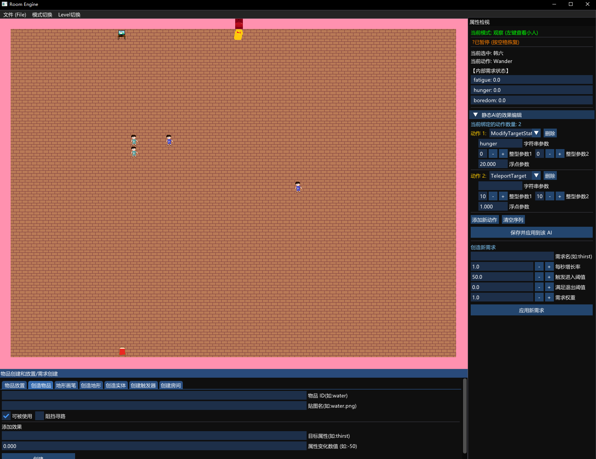

# PraktiseRoom

本项目是一个基于 C++17 , SDL3 和 DearImGui构建的纯数据驱动 2D 智能体模拟沙盒与关卡引擎。

## ✨ 核心特性

本引擎致力于提供高度解耦和完全可视化的运行时编辑体验，支持零 C++ 代码侵入的全面自定义：

* **自定义关卡**
  基于平行世界架构，支持在运行时创建无数个相互隔离的多维房间（Level）。配合空间触发器（Trigger），实现无缝的跨维传送。
* **自定义地形**
  在内置的可视化编辑器中一键注册新地形，动态分配贴图纹理与物理阻挡属性，并使用画笔工具自由绘制。
* **自定义物品**
  灵活定义场景中的交互道具，皆可热加载。
* **自定义需求 (Custom Needs)**
  摆脱硬编码的属性面板。在 UI 中随时增删实体的生存/娱乐需求，自由配置增长率、进入/退出阈值及权重，驱动 AI 产生全新的自发行为。
* **多种 AI 模式**
  内置强大的分层状态机与决策大脑，支持无缝切换：
  * **Utility AI (效用 AI)**：基于需求驱动，全图异步扫描寻找局部最优解。
  * **Static AI (静态 AI)**：基于触发器与数据流，精准执行编排的宏动作序列。
  * **Player**：玩家随时夺舍接管。

---
*Developed by Akingno*